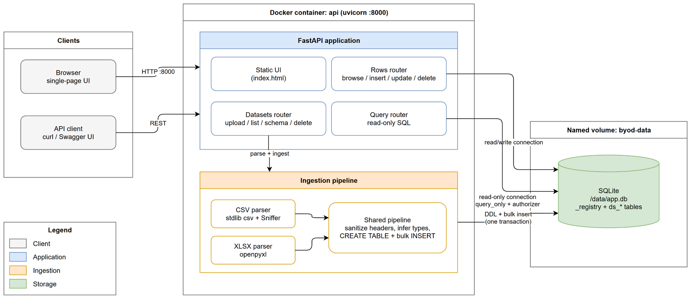

# Bring Your Own Data Service

A containerized FastAPI service that ingests arbitrary CSV (and XLSX) files as independent datasets. One SQLite table per file, schema inferred from the data and exposes a REST API for schema inspection, row CRUD, and read-only SQL queries. A minimal single-page UI is served at the root.

## Architecture



Uploads flow through a format-agnostic ingestion pipeline into one dynamically
created SQLite table per dataset; row CRUD uses the shared read/write
connection, while `/query` runs on a separate connection locked to read-only.
The editable diagram source is at [docs/architecture.drawio](docs/architecture.drawio).

## Requirements

Docker with the Compose plugin. Nothing else is installed on the host.

## Run

```bash
docker compose up --build
```

- UI: http://localhost:8000
- Interactive API docs (Swagger): http://localhost:8000/docs
- Ingested data lives on the named volume `byod-data` and survives
  `docker compose down` / `up`. Use `docker compose down -v` to wipe it.

## Run the tests

```bash
docker compose run --rm api pytest
```

## API walkthrough

The examples use `curl` and work verbatim on macOS, Linux, WSL, and Git Bash
on Windows. Every request can also be executed from the Swagger UI at
`/docs` on any OS, with no shell quoting involved.

### Windows (PowerShell) notes

- `curl` in PowerShell is an alias for `Invoke-WebRequest`; use `curl.exe`.
- Bash line continuations (`\`) are not valid in PowerShell, where the next
  line runs as a separate command. Every example below is a single line, so
  they paste safely into any shell.
- Windows PowerShell 5.1 strips the inner double quotes when passing JSON
  strings to native executables, so the `-d '{...}'` examples below can reach
  the server mangled. Use the Swagger UI, or `Invoke-RestMethod`:

  ```powershell
  Invoke-RestMethod -Method Post -Uri http://localhost:8000/datasets/sales/rows -ContentType "application/json" -Body '{"order_id":3,"amount":7.5}'
  ```

- Create the sample file with:

  ```powershell
  @'
  order_id,amount,ordered_on,note
  1,9.99,2026-01-15,first
  2,12.50,2026-01-16,
  '@ | Set-Content -Path sales.csv -Encoding utf8
  ```

### Create a sample file

```bash
printf 'order_id,amount,ordered_on,note\n1,9.99,2026-01-15,first\n2,12.50,2026-01-16,\n' > sales.csv
```

### Upload a file (dataset name = slugified filename)

```bash
curl -F "file=@sales.csv" http://localhost:8000/datasets
```

```json
{"name":"sales","table":"ds_sales","columns":[{"name":"order_id","type":"integer"},{"name":"amount","type":"real"},{"name":"ordered_on","type":"date"},{"name":"note","type":"text"}],"row_count":2}
```

To upload your own file, pass its path after `@`; the dataset takes its name
from the filename:

```bash
curl -F "file=@/path/to/My Data.csv" http://localhost:8000/datasets   # dataset "my_data"
```

XLSX works the same way (`curl -F "file=@report.xlsx" ...`); the active sheet
is ingested through the same pipeline.

### Upload multiple files at once

```bash
printf 'customer_id,name\n1,ann\n2,bo\n' > customers.csv
printf 'sku,qty\n1,5\n' > inventory.csv
curl -F "files=@customers.csv" -F "files=@inventory.csv" http://localhost:8000/datasets/batch
```

Returns the list of created datasets. The batch is atomic: if any file fails
(malformed content or a name conflict), nothing is ingested.

### List datasets

```bash
curl http://localhost:8000/datasets
```

```json
[{"name":"sales","row_count":2,"created_at":"2026-07-04T08:00:00.000000+00:00"}]
```

### Show a dataset's schema

```bash
curl http://localhost:8000/datasets/sales/schema
```

```json
{"columns":[{"name":"order_id","type":"integer"},{"name":"amount","type":"real"},{"name":"ordered_on","type":"date"},{"name":"note","type":"text"}]}
```

### Browse rows (paginated)

```bash
curl "http://localhost:8000/datasets/sales/rows?limit=1&offset=1"
```

```json
{"rows":[{"_row_id":2,"order_id":2,"amount":12.5,"ordered_on":"2026-01-16","note":null}],"total":2,"limit":1,"offset":1}
```

Every row carries `_row_id`, the synthetic primary key used for addressing.
A single row is available at `GET /datasets/sales/rows/2`.

### Insert a row (missing columns become NULL)

```bash
curl -X POST -H "Content-Type: application/json" -d '{"order_id":3,"amount":7.5,"ordered_on":"2026-01-17"}' http://localhost:8000/datasets/sales/rows
```

```json
{"_row_id":3,"order_id":3,"amount":7.5,"ordered_on":"2026-01-17","note":null}
```

### Update a row (partial; returns the full updated row)

```bash
curl -X PATCH -H "Content-Type: application/json" -d '{"amount":8.0}' http://localhost:8000/datasets/sales/rows/3
```

```json
{"_row_id":3,"order_id":3,"amount":8.0,"ordered_on":"2026-01-17","note":null}
```

### Read-only SQL across datasets

```bash
curl -X POST -H "Content-Type: application/json" -d '{"sql":"SELECT ordered_on, SUM(amount) AS total FROM ds_sales GROUP BY ordered_on"}' http://localhost:8000/query
```

```json
{"columns":["ordered_on","total"],"rows":[["2026-01-15",9.99],["2026-01-16",12.5],["2026-01-17",8.0]]}
```

Joins across `ds_*` tables work. Writes, DDL, `PRAGMA`, `ATTACH`, and any
access to the internal `_registry` table are rejected with 400.

### Delete a row / delete a dataset

```bash
curl -X DELETE http://localhost:8000/datasets/sales/rows/3   # 204
curl -X DELETE http://localhost:8000/datasets/sales          # 204, drops the table
```

### Error semantics

| Status | Meaning |
| --- | --- |
| 400 | Malformed upload (bad CSV/XLSX, binary file, empty or header-only file, oversized row) or rejected SQL |
| 404 | Unknown dataset or row |
| 409 | Dataset name already exists |
| 422 | Unknown column, `_row_id` in a payload, or a type-invalid value |

Every error body is `{"detail": "<human-readable message>"}`.

## Design decisions

- **SQLite over Postgres.** One command, one container, zero configuration; a
  DB file on a named volume gives persistence. Tradeoff: single writer, no
  concurrent scaling, which the brief explicitly does not require.
- **One table per dataset (`ds_<slug>`), columns typed by inference.**
  Arbitrary unknown schemas rule out a fixed data model.
- **Synthetic `_row_id` primary key.** A CSV cannot be trusted to contain a
  usable key, so every table gets `_row_id INTEGER PRIMARY KEY AUTOINCREMENT`
  and all row addressing uses it. A CSV column named `_row_id` is renamed.
- **`_registry` metadata table.** Single source of truth for dataset names,
  columns, logical types, and row counts; the service never introspects
  `sqlite_master` at request time. Also the backbone of SQL-injection safety:
  only registry-validated or sanitizer-produced `[a-z0-9_]` identifiers are
  interpolated into SQL (always double-quoted); all values are bound
  parameters.
- **Best-effort type inference.** Sample up to 1,000 rows per column, try
  INTEGER → REAL → ISO-8601 date → TEXT. Empty strings are NULL and do not
  vote; one non-conforming value demotes the column; leading-zero numerics
  (ZIP codes) stay TEXT; integers beyond 64 bits demote to REAL. Rows beyond
  the sample that do not conform are stored verbatim instead of failing the
  upload.
- **`/query` safety by mechanism, not string inspection.** A separate
  connection with `PRAGMA query_only = ON` plus an authorizer that allows
  only reads and denies `_registry`. Capped at 10,000 rows and 5 seconds so a
  runaway query cannot hang the service.
- **Parsing.** Stdlib `csv` with dialect sniffing, trusted only when the
  detected delimiter appears in the header line. Encodings: UTF-8 (with or
  without BOM), UTF-16/UTF-32 with BOM, latin-1 fallback; NUL bytes are
  rejected as binary. Ragged rows: too few fields are padded with NULL
  (trailing-comma artifact), too many reject the upload with 400 (real
  corruption). XLSX (`openpyxl`) feeds the same pipeline.

## Assumptions and limitations

- Single writer, no concurrency guarantees (per the brief); one shared
  connection, handlers run sequentially.
- Uploads are processed fully in memory; no file-size cap.
- Type inference samples the first 1,000 rows; later non-conforming values
  are stored verbatim.
- Dataset names come from the slugified filename; a duplicate name returns
  409; there is no overwrite.
- Dates are stored as ISO-8601 TEXT with logical type `date`.
- XLSX ingests the active worksheet only; formulas are read as cached values.
- `/query` returns at most 10,000 rows and aborts after 5 seconds.
- The UI refuses to edit integers beyond JavaScript's exact range (±2^53);
  use the API for those.
- No authentication or permissions (explicitly out of scope).
